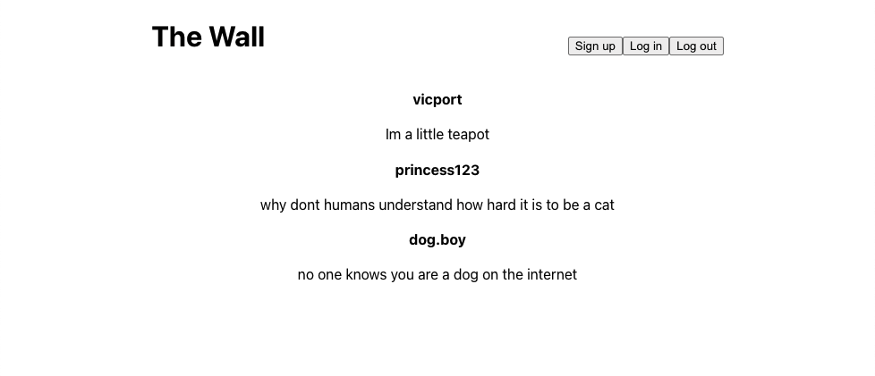
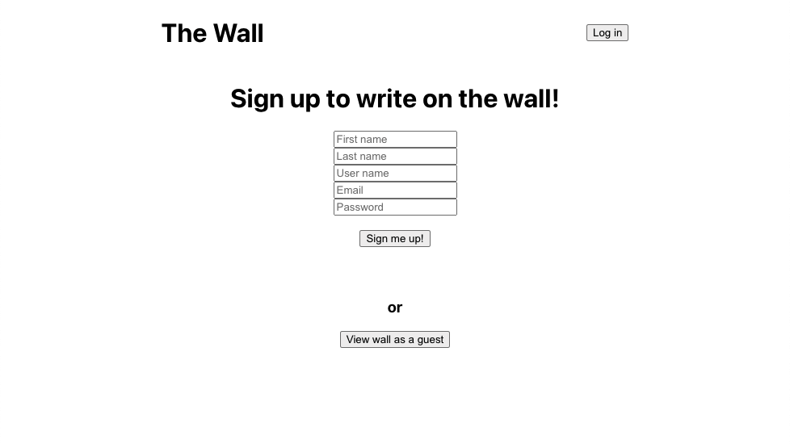
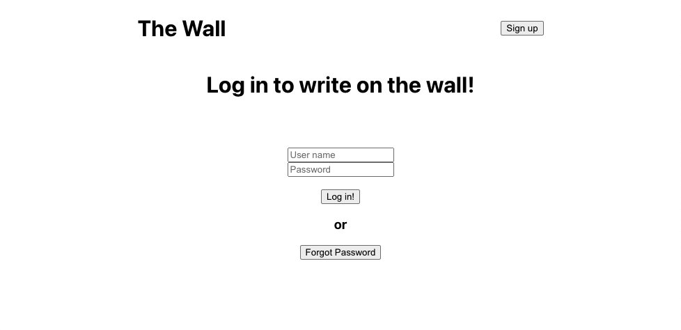
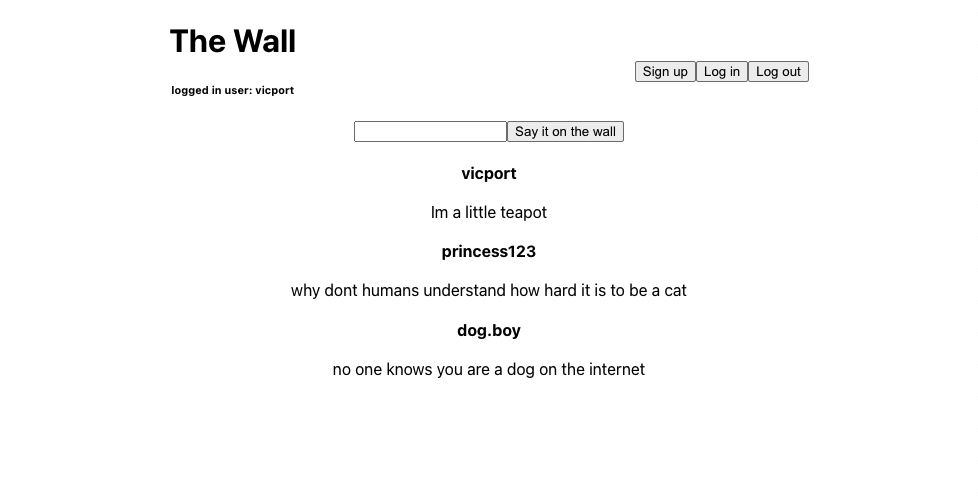

# wall-app-frontend
The wall allows guest users to view a page with posts made by other users. To create a post themselves, users can sign up, log in, and make a post on the wall.

## This React app used: 
- React hooks
- Axios
- Session cookies
- React Router Dom

Home page, guest view

Sign up page

Login page

Home page, logged in view

